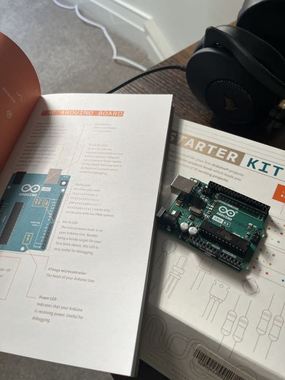
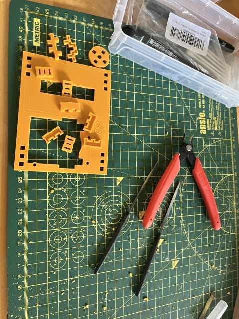
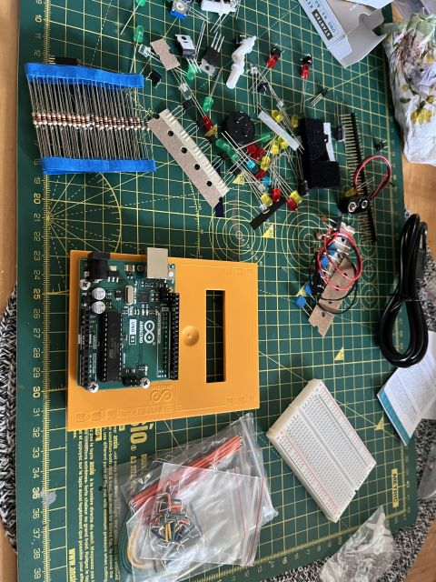

### Unpacking

It's finally here!

The first task involved assembling the plastic sheet that was in the box and will hold the microcontroller and the breadboard.

Just taking a look at the contents of the box and organising them after mounting the microcontroller on the plastic sheet.

