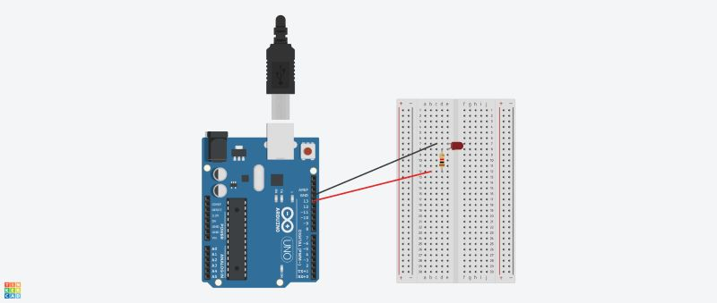

### Blinking light

The first task was to assemble a circuit with a LED that turns on and off on its own.

#### Circuit diagram



#### Code

```cpp
const int POWER_PIN = 13;

void setup()
{
  pinMode(POWER_PIN, OUTPUT);
}

void loop()
{
  digitalWrite(POWER_PIN, HIGH);
  delay(1000); // Wait for 1000 millisecond(s)
  digitalWrite(POWER_PIN, LOW);
  delay(1000); // Wait for 1000 millisecond(s)
}
```

#### Final result

[VIDEO](./task-2-002.MOV)
